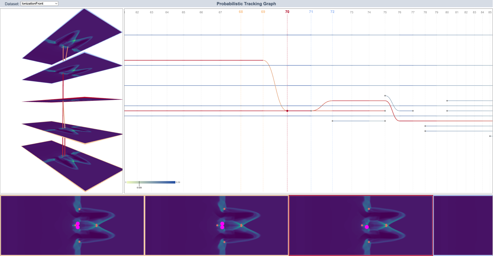

This repository includes two subprojects: a library `Tracking` and a visual analysis system `Tracking-graph-visual-demo`.

# Tracking

## Installation & Usage
```
git clone https://github.com/XinyuanRyanYan/GWMT.git
cd GWMT/Tracking
```
`Example.ipynb` describes the pipeline to use the pFGW library to apply feature tracking using merge trees from time-varying scalar fields.

please refer to `Example.ipynb` for the usage of this library.


## Dependencies
This library requires POT, matplotlib, networkx, and pandas to run.

If you do not have these packages installed, please use the following command to intall them.

```
pip install POT
pip install matplotlib
pip install networkx
pip install pandas
```

# Tracking-graph-visual-demo
Tracking-graph-visual-demo is a web-based framework for interactive analysis and visualization of probabilistic traking graphs and corresponding scalar fields.

## Interface

The main features of our system:

* Select a specific timestamp to highlight it and its neighboring timestamps both in the tracking graph and scalar fields.
* Slide the range bar to filter edges with low probabilities.
* Select a specific feature to highlight edges related to it.




## Installation
```
git clone https://github.com/XinyuanRyanYan/GWMT.git
cd GWMT/Tracking-graph-visual-demo
python app.py
```

After running the above commands, you can run Tracking-graph-visual-demo by visiting http://127.0.0.1:5000/ on the local machine (If possible, please use Chrome).


## Dependencies
This software requires flask and numpy to run.

If you do not have these packages installed, please use the following command to intall them.

```
pip install flask
pip install numpy
```

## Video


